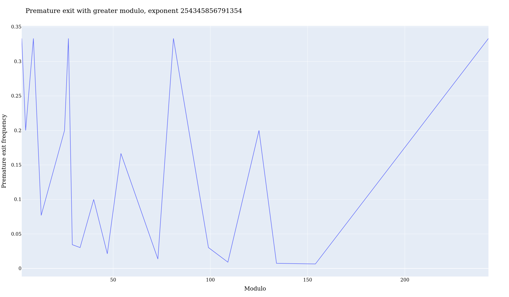

# Fast square and multiply modular exponentiation (FSMMEA), [Christophe Brun](mailto:christophe.brun@papit.fr), [PapIT SASU](https://papit.fr/)

## Abstract

Modular exponentiation: (a^b) mod n can be computed using square and multiply
exponentiation algorithm[^1].
The present algorithm in this repository describes a faster variant stopping the
computation when intermediary modulus is 0.

## Observations

### The modulus of a number by a number that begins with a number it begins with is the same as the modulus of the number by the number it ends with

```
2555 mod 25 = 55 mod 25
```

The number begins 25, so the modulus of 2555 by 25 is the same as the modulus of 55 by 25.
Both are 5.


### Why?

Because `2555 = 25 * 100 + 55` and modulus of `25 * 100 by 25 is 0`, so the modulus
of 2555 by 25 is the same as the modulus of 55 by 25.

### A generalization of the previous observation is that a modulus of a number is equal to the modulus of this number plus another number which modulus is equal to 0

```
5055 mod 25 = 55 mod 25
```

### So can we compute only the smaller number modulus to be faster?

Yes, using the square and multiply modular exponentiation algorithm, if the current
one is equal to 0, the computation can stop, and the algorithm can return 0. There
is no point in multiplying or squaring (just a particular multiplication) again,
the modulus will be 0 anyway.

## Python implementation

Prototyping is done in Python for the ease of development and testing.
The corresponding module is `pysma.py`.
The reference implementation is [`pow` Python built-in method](https://docs.python.org/3/library/functions.html#pow).

## C implementation

For a portable implementation and low-level profiling of the executables,
C is used to test than new implementation.
It is a transpile of the Python code.
The classic square and multiply modular exponentiation is implemented in `sma.c`.
The fast square and multiply modular exponentiation is implemented in `fsma.c`.
Again the reference implementation
is [`pow` Python built-in method](https://docs.python.org/3/library/functions.html#pow).

```C
uint64_t fsma(uint64_t base, uint64_t exp, uint64_t mod) {
    uint64_t res = 1;

    while (exp > 1) {

        // If the exponent digit is 1, then multiply
        if (exp & 1) {
            res = (res * base) % mod;

            // If an intermediate result is zero, we can return 0.
            // The result will be zero anyway
            if (res == 0) {
                return 0;
            }
        }

        // If the exponent digit is 0, then square
        base = (base * base) % mod;
        exp >>= 1;
    }

    return (base * res) % mod;
}
```

### Dependencies

Compilation and tests need LLVM, cmake, Clang/cc/gcc or any compiler, cmake, Valgrind and Python3 for tests and
analysis.

### Compilation

Both sources are compiled as an executable to be used in CLI and shared library
to be loaded using Python for testing purposes.
The compilation is done using the following command:

```bash
$ make all
```

### Testing

The tests are done using a number inferior to a C unsigned 64-Bit integer, the
type used in C programs, as base, exponent, and modulus. Running the
corresponding Python module should end in return code 0 if the result is the
same as the reference implementation `pow` otherwise an `assertionError` is raised.

### Test results

Both `sma.c` and `fsma.c` compiled shared libraries returned results equal to
the reference implementation `pow` for all the numbers inferior to a C unsigned 64-Bit integer tested.

## Hypothesis

The FSMMEA algorithm is generally faster than the SMA algorithm because of the computation ending
sooner in case a temporary modulus is equal to 0.
The impact of comparing the intermediary modulus to 0 is negligible.

## Performance analysis

### Counting instructions using Valgrind

The binaries are compiled Clang 15.0.7 for target x86_64-pc-linux-gnu with `-pg -DNDEBUG` options
Has expected, comparing the temporary remainder to 0 has a cost in terms of instructions. When no intermediate
remainder is 0, the computing function itself execute 10.5% more instructions.
In this case the percentage is constant.

The classic implementation counts 723 instructions:

```bash
$ valgrind --tool=callgrind --toggle-collect=sma ./sma-prof <<<"97032574325492 4294965003 3536"
==1559769== Callgrind, a call-graph generating cache profiler
==1559769== Copyright (C) 2002-2017, and GNU GPL'd, by Josef Weidendorfer et al.
==1559769== Using Valgrind-3.19.0 and LibVEX; rerun with -h for copyright info
==1559769== Command: ./sma-prof
==1559769== 
==1559769== For interactive control, run 'callgrind_control -h'.
1040
==1559769== 
==1559769== Events    : Ir
==1559769== Collected : 723
==1559769== 
==1559769== I   refs:      723
```

The currently described implementation counts 799 instructions:

```bash
$ valgrind --tool=callgrind --toggle-collect=fsma ./fsma-prof <<<"97032574325492 4294965003 3536"
...
==1559866== I   refs:      799
```

When there is an intermediary remainder equal to 0, the number of instructions
is reduced by a proportion that changes depending on the number of square and multiply
left to compute.
Here above an example with a 85% decrease of the number of instructions executed.

The classical implementation counts 583 instructions:

```bash
$ valgrind --tool=callgrind --toggle-collect=sma ./sma-prof <<<"294 98725745 98"
...
==1577575== Events    : Ir
==1577575== Collected : 583
==1577575== 
==1577575== I   refs:      583
```

The currently described implementation counts 86 instructions:

```bash
$ valgrind --tool=callgrind --toggle-collect=fsma ./fsma-prof <<<"294 98725745 98"
...
==1577460== Events    : Ir
==1577460== Collected : 86
==1577460== 
==1577460== I   refs:      86
```

### Measuring time using `clock()`

More instructions are required but instructions time cost can vary of several orders of magnitude.
On both x86_64 Intel and RISC-V 64 machines, the time cost of the comparison is negligible.
The programs `sma-chrono` (classical implementation) and `fsma-chrono` (this implementation) are used to measure the
time cost in seconds using `time.h` library `clock()` function.
Both functions are executed 10 millions times to spread the possible time variations.
The results when no intermediary remainder is equal to 0 are almost the same:

```bash
# Details of the x86_64 machine
$ uname -a
... 6.3.1-060301-generic ... SMP PREEMPT_DYNAMIC ... x86_64 GNU/Linux
# Both programs are executed 10 millions times in the same time without
# intermediary remainder equal to 0
$ ./fsma-chrono <<< "2945 98725745 98"
59
Time: 3.793387
$ ./sma-chrono <<< "2945 98725745 98"
59
Time: 3.862384
```

Quite often this new implementation is slightly faster than the classical one, on both platforms under test.
But it is surely not relevant on a Linux desktop PC.

When there is an intermediary remainder equal to 0, the time cost of the comparison is significant:

```bash
# Details of the x86_64 machine
$ uname -a
... 6.3.1-060301-generic ... SMP PREEMPT_DYNAMIC ... x86_64 GNU/Linux
# Significant time difference when an intermediary remainder is
# equal to 0
$ ./fsma-chrono <<< "294 98725745 98"
0
Time: 0.044720
$ ./sma-chrono <<< "294 98725745 98"
0
Time: 3.798237
```

The new implement represent ~1.1% on x86_64 of the time of the classical one, therefore the name of the algorithm
is Fast Square
and Multiply Modular Exponentiation Algorithm Modular Exponentiation...

As expected the same computations highlight a slightly lower gain time on a less complex ISA like RISC-V.
The binaries were compiled for target riscv64-redhat-linux GCC 12.1.1.
But still superior to ten folds :

```bash
# Details of the RISC-V 64 machine
$ uname -a
... 5.5.0-0.rc5.git0.1.1.riscv64.fc32.riscv64 #1 SMP ... riscv64 GNU/Linux
# Both programs are executed 10 millions times in the same time without
# intermediary remainder equal to 0
$ ./fsma-chrono <<< "294 98725745 98"
0
Time: 0.472115
$ ./sma-chrono <<< "294 98725745 98"
0
Time: 5.238649
```

Likewise, even on a more simple architecture like RISC-V, the cost of comparing
the remainder to zero is negligible :

```bash
# Details of the RISC-V 64 machine
$ uname -a
... 5.5.0-0.rc5.git0.1.1.riscv64.fc32.riscv64 #1 SMP ... riscv64 GNU/Linux
# Significant time difference when an intermediary remainder is equal to 0
$ ./fsma-chrono <<< "294 98725745 985"
4
Time: 5.322550
[root@fedora-riscv fsma]# ./sma-chrono <<< "294 98725745 985"
4
Time: 5.346250
```

### Analysing the premature exit of the algorithm

The proportion of instructions executed is not constant, nore the time, and the chance of having
an intermediary remainder equal to 0 is not constant either. It surely increases
with the number of square and multiply to compute.
To measure those phenomenons, the C is not adapted. A more high-level language
like Python with its data science tools is needed.

The frequency of the premature exit, i.e., intermediary remainder equal to 0 of
the algorithm does not change with the base.
But it changes with the modulus.
The following graph shows the frequency (linear regression to suppress variations du to sampling) of premature exit of
the algorithm function of the base.


But the frequency of premature exit tend to diminish with the modulo getting greater.



[^1]: Christof Paar, Jan Pelzl, Understanding Cryptography, section 7.4